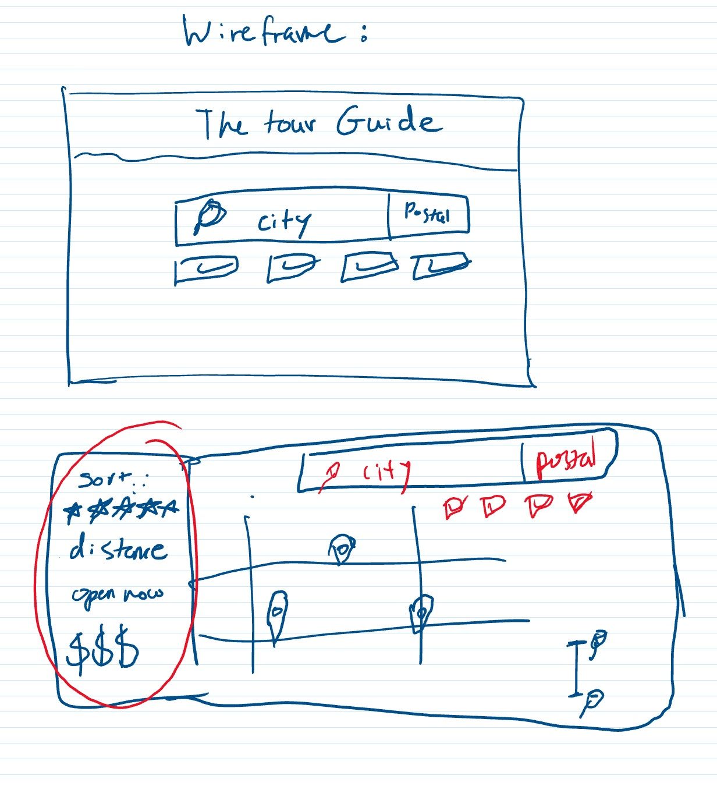
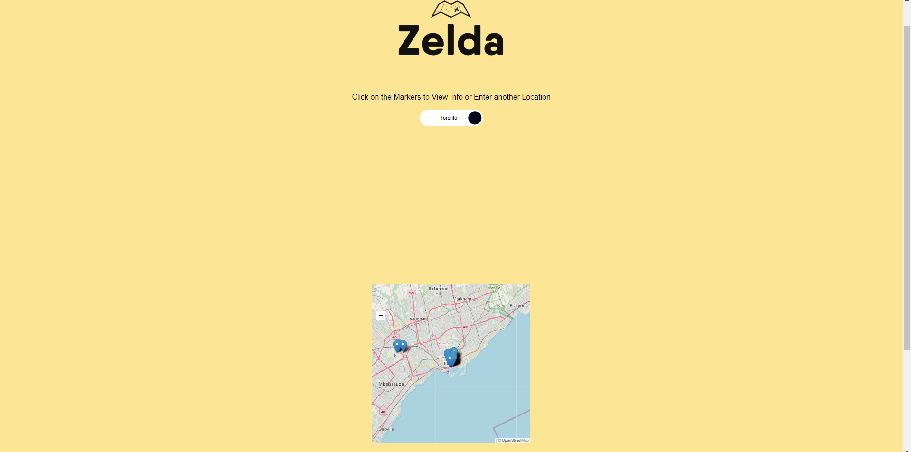

# Project-01 light weight travel companion for events and hotels

## Description
This project creates a lightweight travel companion as a proof of concept to gather information on hotels and music events in a searched city. This is accomplished by calling on a series of APIs to take the string input of a city name, convert it to a set of coordinates to center the map in that location. following this the map will be populated by marker icons with delegated event listeners that will pop up with further details on the chosen location.

The core functions of this application are limited currently mostly due to the use of the various free APIs. While it would have been convienient to use paid services such as foursquare and google maps to accomplish this same task, this would have taken away of the learning experience of combining the services of many moving parts to accomplish a certain goal.

The polished UI using HTML and tailwinds css is simple yet effective in its design and implementation, which while the application lacks power it is easy to envision what this app could accomplish with some extra development time. While developing the group was able to peel back layers of features to get to the root functions we wanted this app to accomplish. Given enough time for development extra features such as search options, routing, and a larger data set of hotels could be added.
 
 

## Mock Up and screenshots

Below you will see the wireFrame and a mock up.
wireframe

search page screen shot

## featured technologies

Below are links to the various 3rd party APIs and libraries used to compile this application.
[leaflet](https://leafletjs.com/)
[hotels4](https://rapidapi.com/apidojo/api/hotels4/)
[ticketmaster](https://developer.ticketmaster.com/)
[open cage data](https://opencagedata.com/)
[tailwinds](https://tailwindcss.com/) 

## Installation

  The website can be viewed through GitHub pages [here](https://ydennekrf.github.io/Node-Aero/)

## Credits

  Many lessons and tutorials were used from:
   
  [W3 schools](https://www.w3schools.com/)
   
  [MDN Web Docs](https://developer.mozilla.org/en-US/)
   

## License
[GNU](https://choosealicense.com/licenses/gpl-3.0/#)
